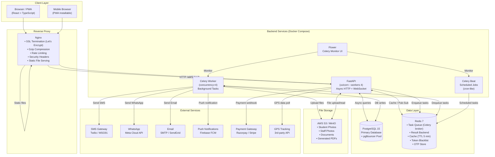
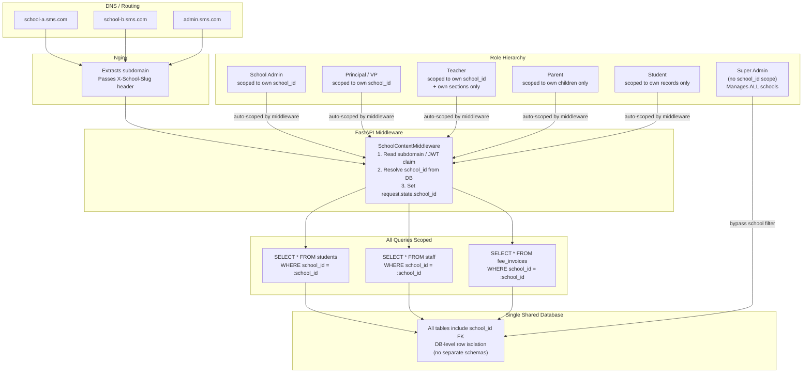
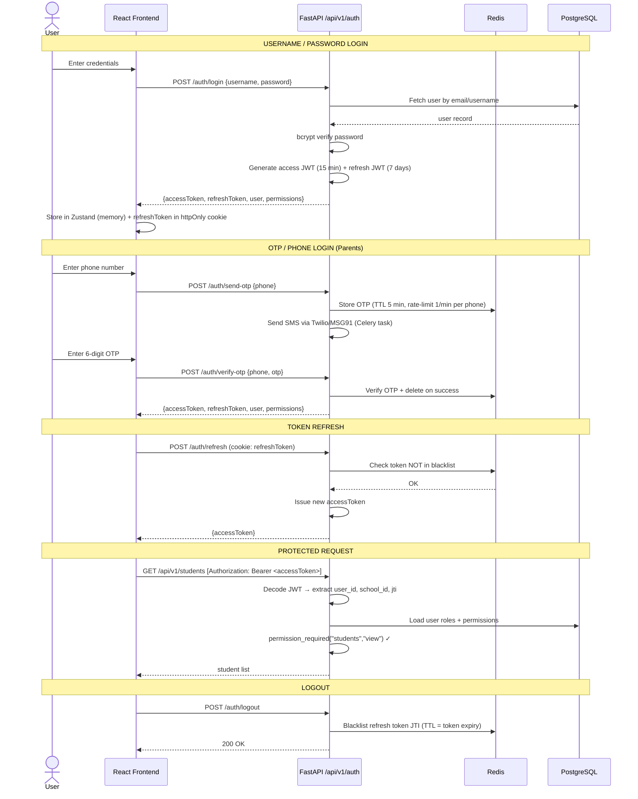
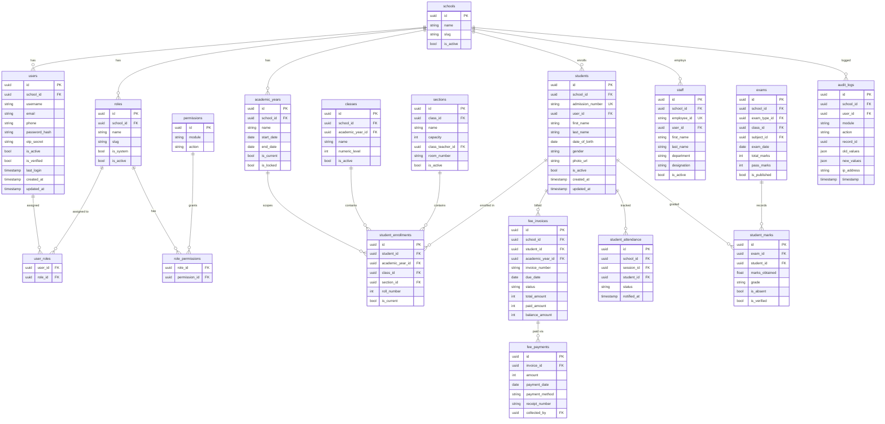
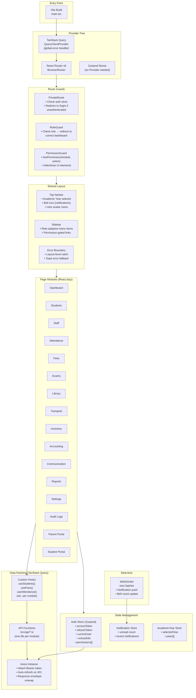
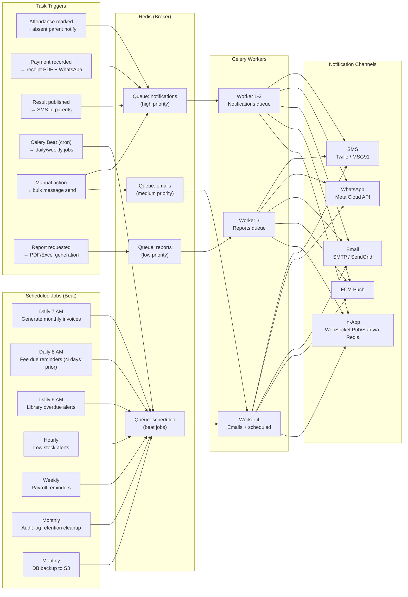
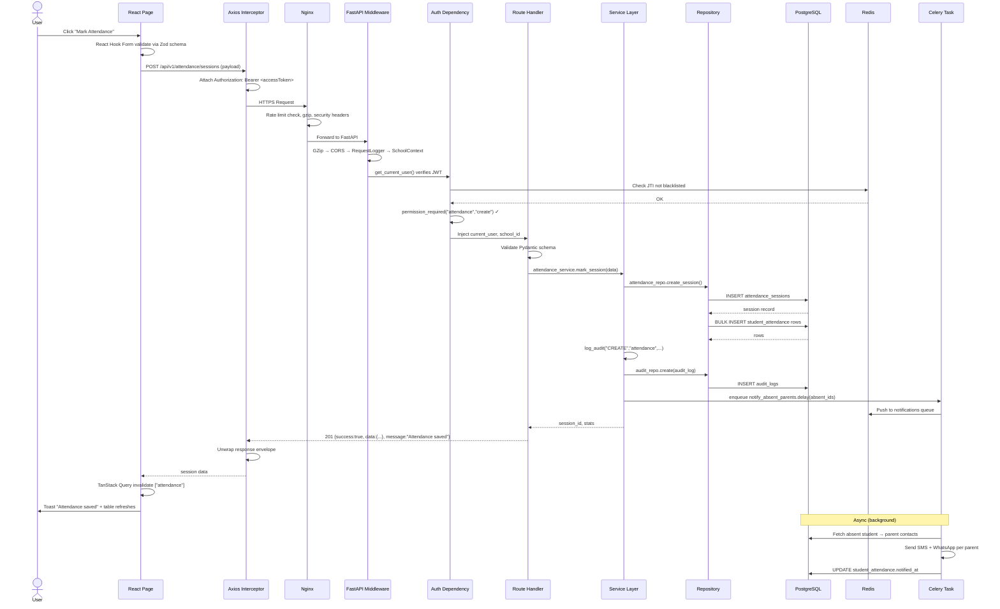
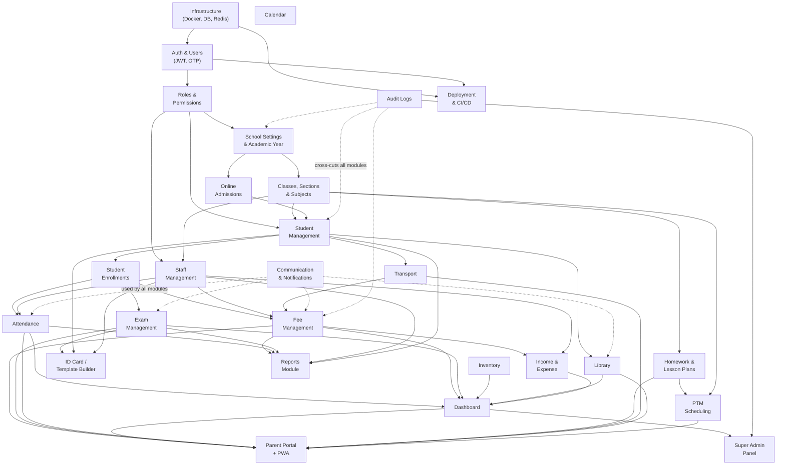
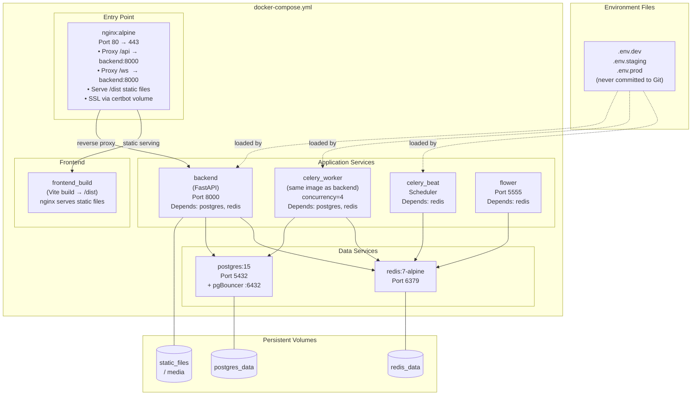

# SeptroSchool — Architecture Diagrams

---

## 1. System Overview (Infrastructure Layer)

---

## 2. Backend Application Layer Architecture

```mermaid
graph LR
    subgraph REQUEST["Incoming Request"]
        REQ["HTTP Request\n/api/v1/students"]
    end

    subgraph MIDDLEWARE["Middleware Stack (LIFO)"]
        MW1["GZip Middleware"]
        MW2["CORS Middleware"]
        MW3["Request Logger"]
        MW4["School Context\nExtractor\n(subdomain / JWT)"]
    end

    subgraph AUTH["Auth / Security Layer"]
        JWT["JWT Dependency\nget_current_user()"]
        PERM["Permission Dependency\npermission_required(\n  module, action\n)"]
    end

    subgraph ROUTES["API Routes\n/app/api/v1/"]
        R1["students.py"]
        R2["fees.py"]
        R3["attendance.py"]
        R4["exams.py"]
        R5["auth.py"]
        RN["... (one file\nper module)"]
    end

    subgraph SCHEMAS["Pydantic v2 Schemas\n/app/schemas/"]
        SC["Request validation\nResponse serialization\ncamelCase output"]
    end

    subgraph SERVICES["Service Layer\n/app/services/"]
        SV["Business Logic\n• Fee calculation\n• Rank computation\n• Promotion logic\n• PDF generation\n• Audit log calls"]
    end

    subgraph REPO["Repository Layer\n/app/repositories/"]
        RP["Database Queries\n• SQLAlchemy async\n• selectinload / joinedload\n• Pagination helpers\n• Soft-delete filters"]
    end

    subgraph TASKS["Celery Tasks\n/app/tasks/"]
        TK["Async Jobs\n• Send SMS/Email/WhatsApp\n• Generate PDF reports\n• Invoice generation\n• Low stock alerts\n• Audit log retention"]
    end

    subgraph DB["Data Layer"]
        PG[("PostgreSQL")]
        RD[("Redis")]
    end

    REQ --> MW1 --> MW2 --> MW3 --> MW4
    MW4 --> JWT --> PERM
    PERM --> ROUTES
    ROUTES --> SC
    SC --> SERVICES
    SERVICES --> REPO
    SERVICES --> TASKS
    REPO --> PG
    TASKS --> RD
    TASKS --> PG
```

---

## 3. Multi-Tenant Architecture

---

## 4. Authentication & Authorization Flow

---

## 5. Database Entity Relationship (Core Tables)

---

## 6. Frontend Application Architecture

---

## 7. Celery Background Job Architecture

---

## 8. Request Lifecycle (End-to-End)

---

## 9. Module Dependency Map

---

## 10. Docker Compose Service Topology

---

*Generated for: SeptroSchool (School ERP)*
*Stack: FastAPI · PostgreSQL · Redis · Celery · React 18 · TypeScript · Tailwind CSS*
